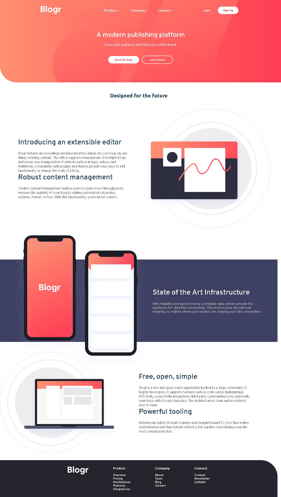

<h1 align="center">
BLOGR LANDING PAGE FRONTENDMENTOR - JUNIOR
</h1>

## SOBRE O DESAFIO
 O objetivo é construir uma pagina mais parecida como desgin original e meus usuários devem ser capazes de:

- Visualize o layout ideal para o site, dependendo do tamanho da tela do dispositivo
- Veja os estados de foco para todos os elementos interativos na página.

o maior desafio que tive foi ajustar o menu para versão mobile.
estudei e achei a melhor solução que foi a Collapsible animation(CSS) e consegui um resultado satisfatorio podendo aplicar o que conheci.

## Participants

[Sammynauta](https://github.com/Sammynauta)

## Resources

- [x] HTML, CSS, JS
- [x] SVG Images
- [x] GOOGLE FONTS
- [x] JQUERY CDN